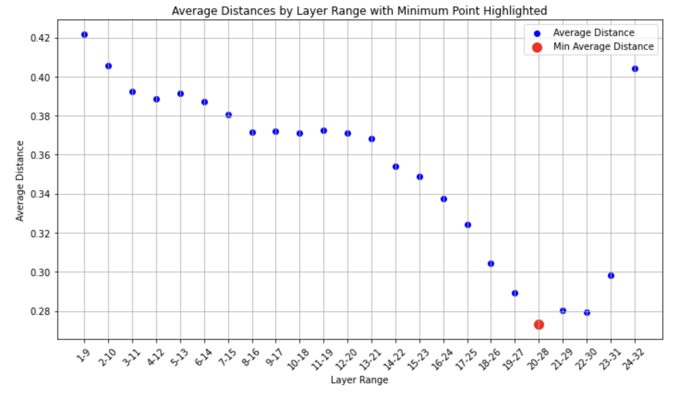
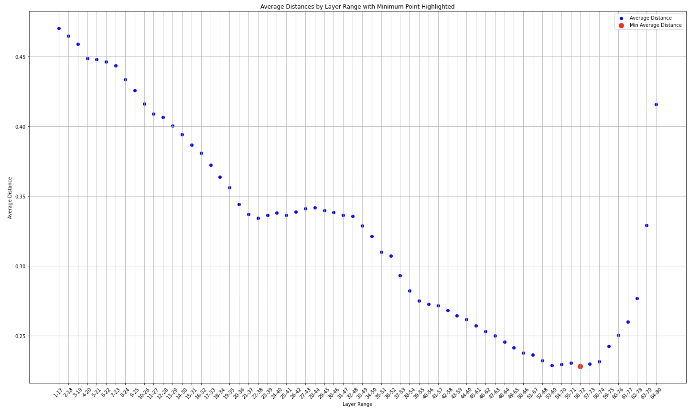

# layerSlayer

## An Approach to Extreme Quantization and Pruning

This project was completed during the GPU Mode Hackathon on September 21, 2024 by Trishala Neeraj & Debajyoti Datta.

### Goal

To quantize and sparsify the LLaMA family models. Specifically, we seek to reduce PyTorch gpt-fast's latency for n=1 batch size. 

### Project Overview

We combined tensor parallel techniques from [gpt-fast](https://github.com/pytorch-labs/gpt-fast) with quantization methods from [torchao](https://github.com/pytorch/ao), and utilized an existing layer pruning approach. During the hackathon, we made direct modifications to code from the torchao/_models/llama repository and gpt-fast.

### Approach

1. **Identify Layers to Prune**
   - We drew inspiration from "The Unreasonable Ineffectiveness of the Deeper Layers" by Gromov et al. (2024).
   - We utilized the [PruneMe](https://github.com/arcee-ai/PruneMe) repository to identify optimal blocks of layers for pruning.
   - Below are the plots of average angular distances by layer blocks for Llama3.1-8B and 70B models. The range highlighted in red is the best candidate for pruning as it contains the most similar, and potentially redundant layers (using angular distance as the metric).

#### meta-llama/Meta-Llama-3.1-8B-Instruct: blocks of 8 layers

#### meta-llama/Meta-Llama-3.1-70B-Instruct : blocks of 16 layers

   
2. **Remove Identified Layers**
   - We then directly remove the identified layers (see lines 206-207 in `generate.py`).
   - Future plan: Implement "healing" (explained well in the paper by Gromov et al) using QLoRA to recover from potential performance loss due to pruning.

3. **Quantize**
   - Applied int8wo-based quantization.

### Performance Comparison

Below are latency comparisons for different configurations of Llama-3.1-8B and Llama-3.1-70B:

| 8b | quantization | tp | tokens per second |
|---|---|---|---|
| | No | 8 | 310 tokens/second |
| | int8wo | 8 | 330 tokens/second |
| | With_pruning + int8wo | 8 | 412 tokens/second |

| 70b | quantization | tp | tokens per second |
|---|---|---|---|
| | No | 8 | 75 tokens/second |
| | int8wo | 8 | 101 tokens/second |
| | With_pruning + int8wo | 8 | 124 tokens/second |

### Acknowledgments

- GPU Mode Hackathon organizers and mentors. Special thanks to our Hackathon mentors Charles Hernandez and Jesse Cai from the PyTorch team, and Hicham Badri from the Mobius team.
- Authors of the "The Unreasonable Ineffectiveness of the Deeper Layers" paper.
- Contributors to the PruneMe, torchao, and gpt-fast projects.
